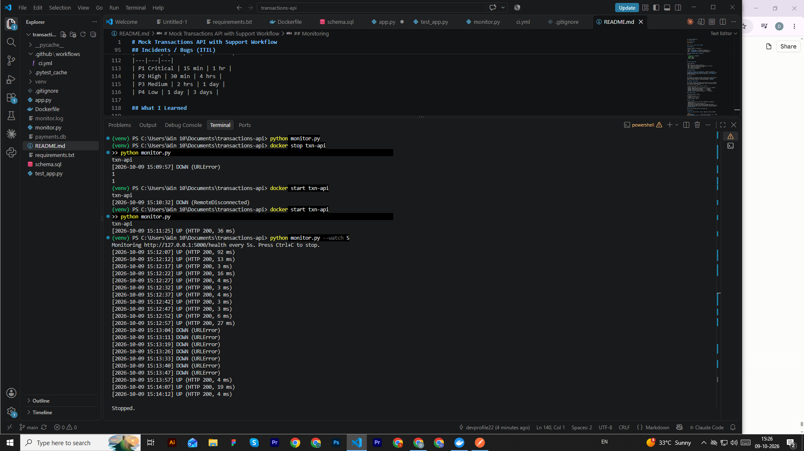

# Mock Transactions API with Support Workflow


A small REST API that simulates a payment/transaction system, built to
practice backend development, API testing, and ITIL-based incident
management.

## What this project does

- A Flask-based REST API with endpoints to create and fetch transactions
- A SQLite database with a hand-written schema (accounts + transactions)
- A Postman collection covering both success and failure test cases
- 5 deliberately injected bugs, each documented as a support ticket
  following ITIL structure (severity, priority, SLA) and resolved

## Tech Stack

- Python 3 + Flask
- SQLite
- Postman

## Project Structure
transactions-api/
├── app.py # API code
├── schema.sql # Database schema
├── payments.db # SQLite database (auto-created)
├── postman/
│ └── Transactions API.postman_collection.json
├── tickets/
│ ├── INC-001.md
│ ├── INC-002.md
│ ├── INC-003.md
│ ├── INC-004.md
│ └── INC-005.md
└── README.md

## How to Run

```bash
# 1. Create and activate virtual environment
python -m venv venv
venv\Scripts\activate        # Windows

# 2. Install dependencies
pip install flask

# 3. Run the server
python app.py
```

Server runs at `http://127.0.0.1:5000`

## API Endpoints

| Method | Endpoint | Description |
|---|---|---|
| POST | `/transaction` | Create a new transaction |
| GET | `/transaction/{id}` | Fetch a transaction by ID |
| GET | `/account/{id}` | Fetch an account's balance |

### Example Request (POST /transaction)
```json
{
  "reference_id": "TXN-1001",
  "account_id": 1,
  "amount": 500,
  "type": "DEBIT"
}
```

### Status Codes Used

| Code | Meaning |
|---|---|
| 201 | Transaction created successfully |
| 400 | Invalid input (missing field, bad amount, bad type) |
| 404 | Account or transaction not found |
| 409 | Duplicate reference_id |
| 422 | Insufficient balance |

## Database Schema

Two tables: `accounts` and `transactions`, linked by a foreign key
(`transactions.account_id → accounts.account_id`). `reference_id` has a
UNIQUE constraint to prevent duplicate transactions. See `schema.sql`
for full definition.

## Testing

All endpoints were tested in Postman, including failure cases (invalid
input, duplicate reference_id, non-existent account, insufficient
balance, not-found resource). Collection exported to `/postman`.

## Incidents / Bugs (ITIL)

This project includes 5 deliberately injected bugs, each to be handled
as an incident: documented, investigated, fixed, and closed following
ITIL structure. Work in progress.

| Ticket | Title | Severity | Priority | Status |
|---|---|---|---|---|
| [INC-001](tickets/INC-001.md) | Duplicate transaction processed | Sev 2 | P2 | Closed |
| [INC-002](tickets/INC-002.md) | Negative amount accepted | Sev 2 | P2 | Closed |
| [INC-003](tickets/INC-003.md) | API timeout on GET request | Sev 3 | P3 | Closed |
| [INC-004](tickets/INC-004.md) | 500 error instead of 404 | Sev 3 | P3 | Closed |
| INC-005 | Account balance inconsistency | - | - | Pending |

### SLA Matrix Used

| Priority | Respond | Resolve |
|---|---|---|
| P1 Critical | 15 min | 1 hr |
| P2 High | 30 min | 4 hrs |
| P3 Medium | 2 hrs | 1 day |
| P4 Low | 1 day | 3 days |

## What I Learned

- Writing SQL schemas with constraints (PRIMARY KEY, FOREIGN KEY,
  UNIQUE, CHECK)
- Building and testing a REST API end to end
- Using Postman for manual and automated (scripted) API testing
- Writing incident tickets with clear issue/impact/root-cause/resolution
- Applying ITIL concepts: severity, priority, SLA, incident lifecycle
## Run with Docker

Pull and run the image directly from Docker Hub:

## Monitoring

`monitor.py` pings the API's `/health` endpoint and reports UP/DOWN.

```bash
python monitor.py              # check once (exit code 0 = UP, 1 = DOWN)
python monitor.py --watch 10   # check every 10 seconds
```

Results are also appended to `monitor.log`.



The API will be available at `http://127.0.0.1:5000`.
