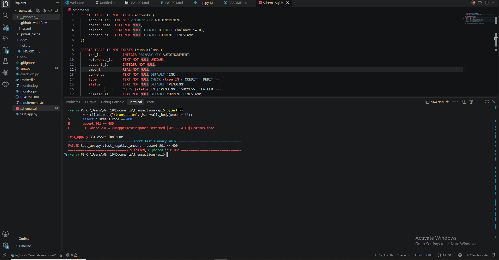
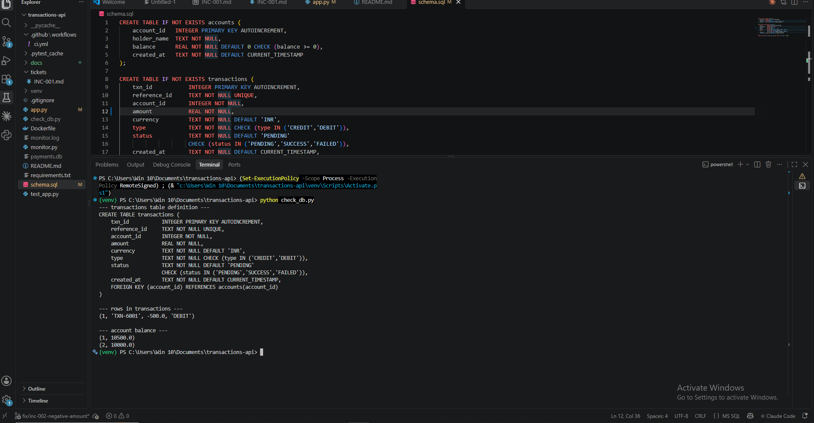
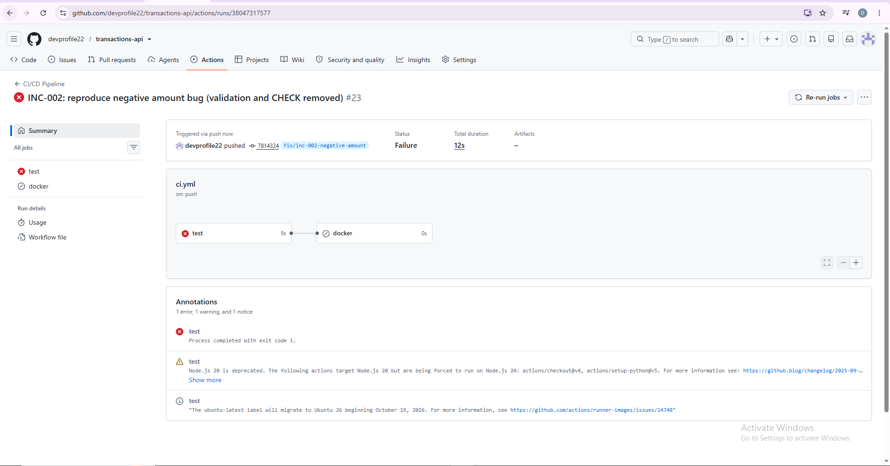

# INC-002: Negative amount accepted, balance increases on DEBIT

| Field | Value |
|---|---|
| Ticket ID | INC-002 |
| Reported by | Internal testing (pytest / Postman) |
| Date opened | 2026-10-10 16:32:25 |
| Category | Application / Input validation |
| Severity | Sev 2 (High) |
| Priority | P2 |
| SLA | Respond in 30 min, resolve in 4 hrs |
| Status | In Progress |

## Issue
POST /transaction with amount -500 and type DEBIT returned 201 Created.
The request should have been rejected with 400 Bad Request.

## Impact
- A DEBIT with a negative amount increases the balance instead of
  reducing it: money is created from nothing (balance 10000 -> 10500).
- Anyone who can call the API can inflate balances or hide debits.
- Corrupts financial data for every account, so the damage is serious.

## Severity and Priority reasoning
| Question | Answer |
|---|---|
| Impact | High: wrong money values in the database, affects all accounts |
| Urgency | Medium-high: easy to trigger, but nothing is lost permanently
  if fixed quickly |
| Priority (Impact x Urgency) | P2 |
| Severity | Sev 2: service is up, but data integrity is broken |
| Why not P1 / Sev 1 | The API is still running and no customer data was
  lost; only newly written rows can be wrong |

## Steps Taken
1. Reproduced in Postman: amount -500 with DEBIT returned 201.
2. Ran pytest: test_negative_amount failed (assert 201 == 400).
3. Pushed the branch: CI (GitHub Actions) failed on the same test.
4. Queried payments.db: row (TXN-6001, -500.0, DEBIT) exists and the
   account balance went from 10000 to 10500.
5. Inspected the code: the check "amount <= 0" is missing in app.py,
   and the CHECK (amount > 0) constraint is missing in schema.sql.

## Root Cause
Positive-amount validation was missing in two layers: the application
check in app.py and the CHECK (amount > 0) constraint in schema.sql.
Note: with only one layer missing the database would still reject the
row, but the code catches IntegrityError and reports it as
"Duplicate reference_id" (409), which is a misleading error.

## Evidence (before fix)

**pytest failing** (assert 201 == 400):

**Database: negative row and increased balance:**

**CI red on GitHub Actions:**

