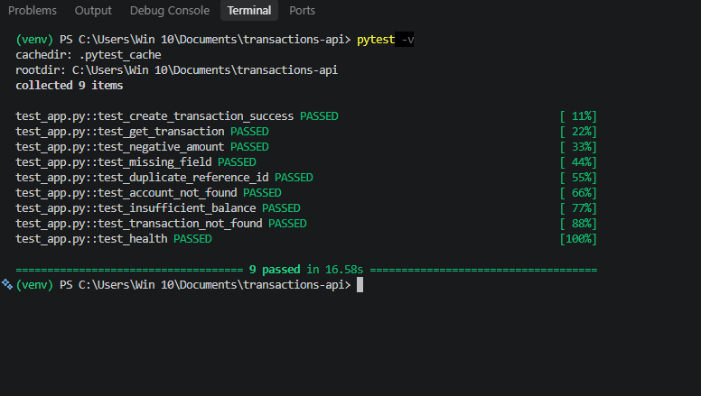
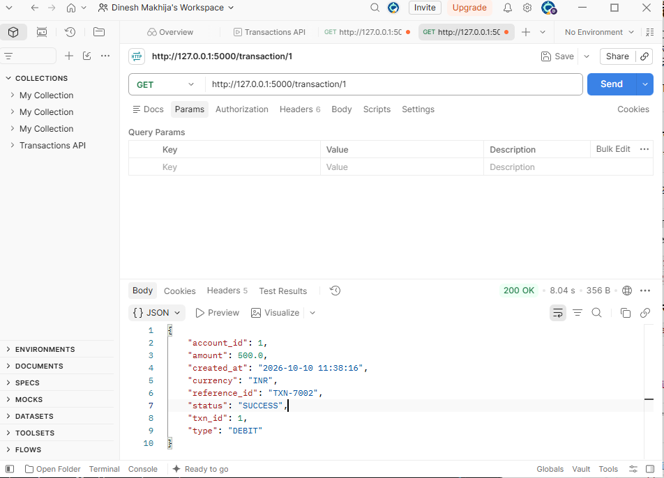
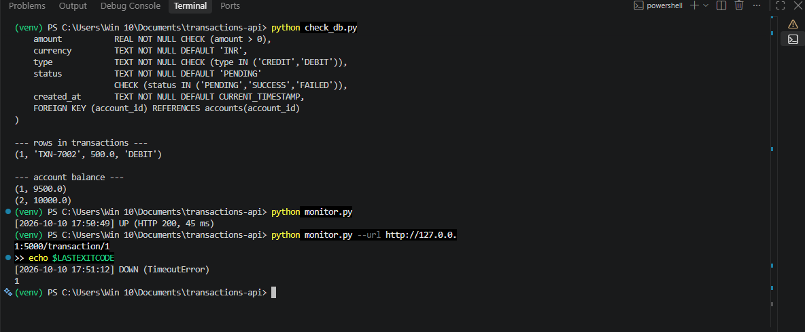
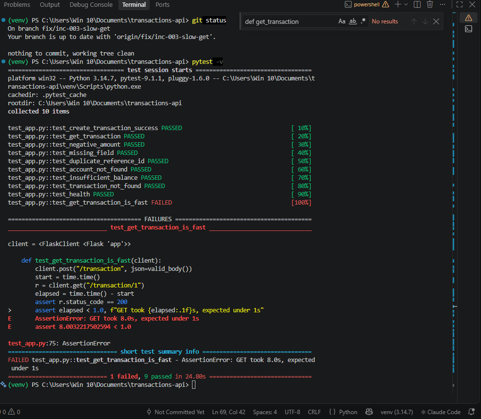
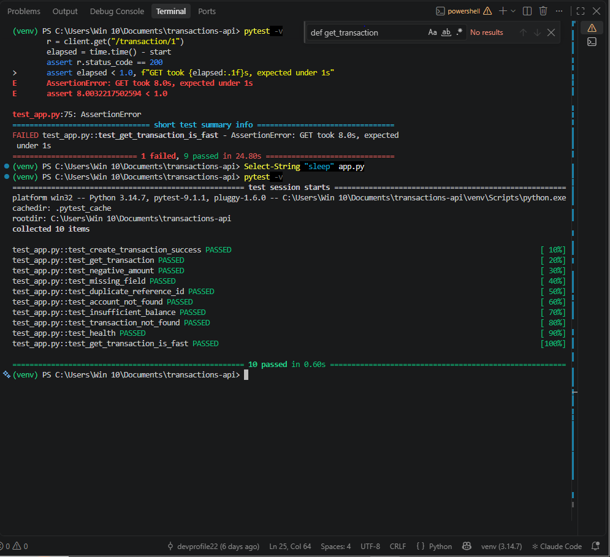
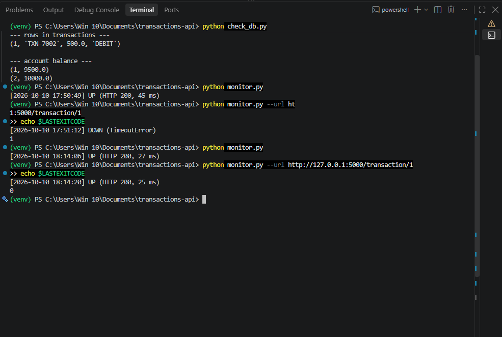

# INC-003: GET /transaction/{id} responds slowly, clients time out

| Field | Value |
|---|---|
| Ticket ID | INC-003 |
| Reported by | Monitoring (monitor.py) |
| Date opened | 2026-10-10 17:50 |
| Category | Application / Performance |
| Severity | Sev 3 (Medium) |
| Priority | P3 |
| SLA | Respond in 2 hrs, resolve in 1 day |
| Status | Closed |

## Issue
GET /transaction/{id} takes about 8 seconds to respond. The monitoring
script, which gives up after 3 seconds, reports the endpoint as DOWN,
while /health still reports UP.

## Impact
- Clients with short timeouts see failed requests; users see hanging screens.
- Data is correct and no money is affected, so this is a degraded service, not an outage.
- Clients that time out tend to retry, which adds load. Retried POSTs are safe only because of the UNIQUE fix in INC-001.

## Severity and Priority reasoning
| Question | Answer |
|---|---|
| Impact | Medium: one read endpoint is slow, writes and data are fine |
| Urgency | Medium: annoying for users but no data or money at risk |
| Priority (Impact x Urgency) | P3 |
| Severity | Sev 3: service is up but degraded |
| Why not P2 or higher | No data corruption, /health and POST work, nothing is lost while it is slow |

## Steps Taken
1. Ran monitor.py on /transaction/1: DOWN (timeout after 3 s), exit code 1.
2. Ran monitor.py on /health: still UP. The health check only runs SELECT 1, so it does not exercise this endpoint.
3. Measured in Postman: GET /transaction/1 took about 8 s.
4. pytest: 9 passed but the run took about 16 s instead of under 1 s. No test checks response time, so CI stayed green.
5. Inspected get_transaction in app.py: a time.sleep(8) call at the start of the function.

## Root Cause
A blocking time.sleep(8) at the start of get_transaction (simulating a slow query or blocking call). It was not detected earlier because /health does not check this endpoint and no test asserts response time.

## Evidence (before fix)

**pytest passed but slow (about 16 s):**

**Postman: GET takes about 8 s:**

**Monitor: /health UP but /transaction/1 DOWN:**

## Resolution
Removed the blocking time.sleep(8) from get_transaction in app.py and
added a response-time test. Verified:
- pytest: 10 passed in under 1 s (previously about 16 s)
- Postman: GET /transaction/1 returns immediately
- monitor.py: /transaction/1 is UP again (exit code 0)

## Preventive Action
- New test test_get_transaction_is_fast fails if GET /transaction/{id}
  takes longer than 1 s. It failed against the buggy code (1 failed,
  9 passed), so CI will catch this next time.
- Lesson: /health only runs SELECT 1 and stayed UP while a real endpoint
  was broken. Monitor at least one real endpoint, not only /health.
- Follow-up idea: have monitor.py check several endpoints in one run.

## Evidence (after fix)

**New test failed on the buggy code, proving it detects the problem:**

**pytest: 10 passed, fast:**

**Monitor: /health and /transaction/1 both UP:**

Date resolved: 2026-10-10 18:30
Date closed:   2026-10-10 18:40