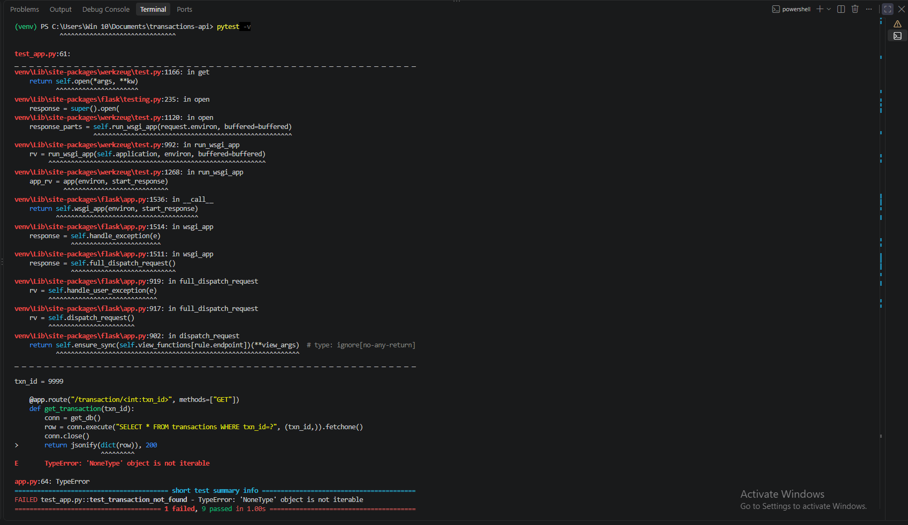
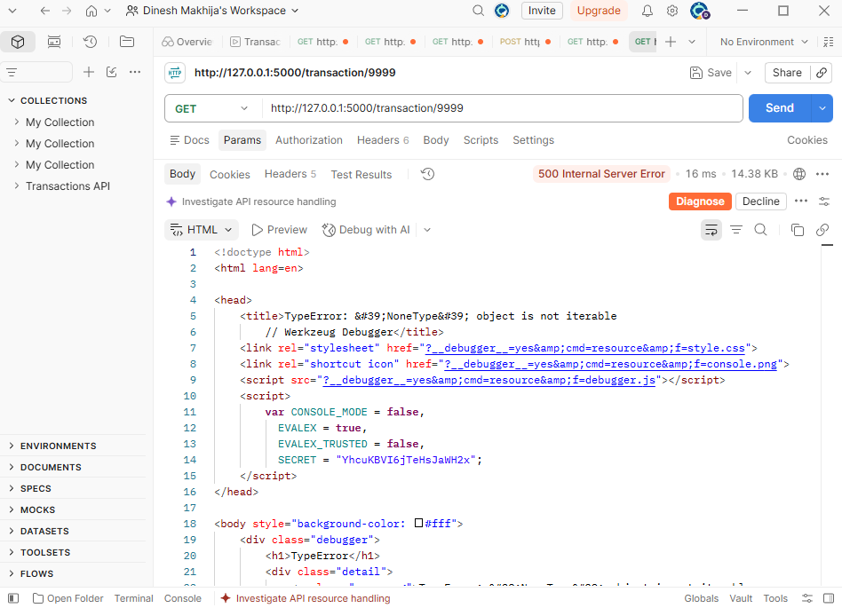
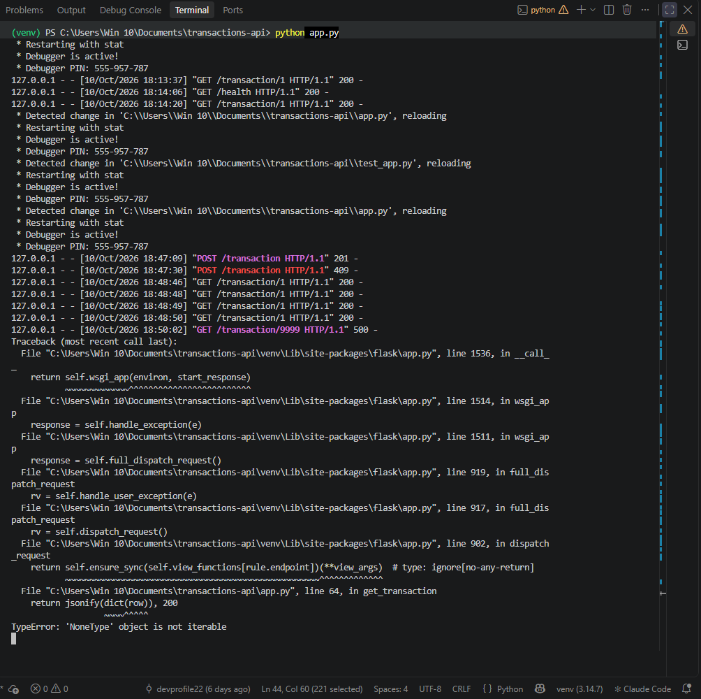
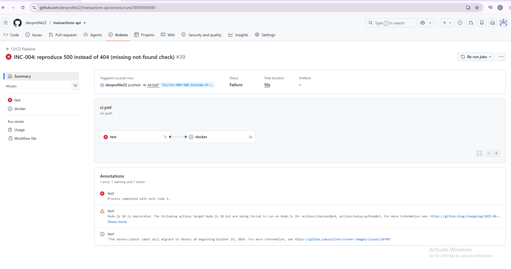
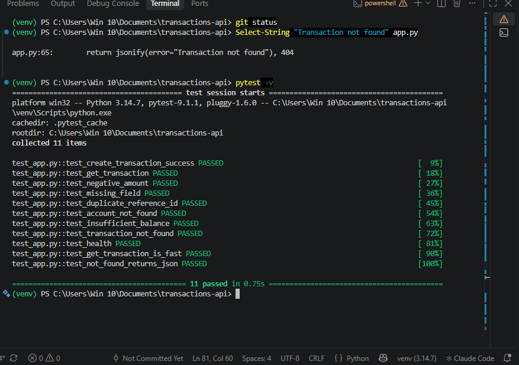
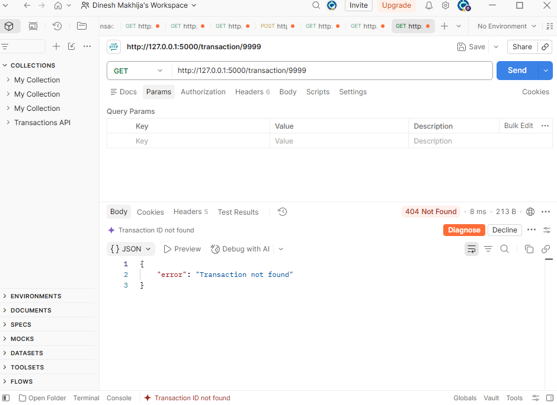

# INC-004: GET for an unknown transaction ID returns 500 instead of 404

| Field | Value |
|---|---|
| Ticket ID | INC-004 |
| Reported by | Internal testing (pytest / Postman) |
| Date opened | 2026-10-10 19:00 |
| Category | Application / Error handling |
| Severity | Sev 3 (Medium) |
| Priority | P3 |
| SLA | Respond in 2 hrs, resolve in 1 day |
| Status | Closed |

## Issue
GET /transaction/9999 (an ID that does not exist) returns 500 Internal Server Error with an HTML traceback page. It should return 404 Not Found with a JSON error message.

## Impact
- Clients cannot tell "this record does not exist" from "the server is broken", so they may retry or show a wrong error to the user.
- Monitoring and alerting treat 500 as a server failure, which creates false alarms for what is an ordinary missing record.
- The response is HTML, not JSON, so clients that parse JSON break on it.
- With debug mode on, the response includes the traceback and source code lines, which exposes internal details (information disclosure).
- No data is lost or corrupted, and valid IDs still work.

## Severity and Priority reasoning
| Question | Answer |
|---|---|
| Impact | Low-medium: only requests for missing IDs, but they are common (typos, deleted records) |
| Urgency | Medium: misleading errors and noisy alerts, but nothing is lost |
| Priority (Impact x Urgency) | P3 |
| Severity | Sev 3: wrong behaviour on one path, service otherwise healthy |
| Why not higher | No money or data at risk, valid requests return 200 |
| Note | The traceback exposure is a security concern and is tracked as a follow-up below |

## Steps Taken
1. Reproduced in Postman: GET /transaction/9999 returned 500 with an HTML traceback page, while GET /transaction/1 still returned 200.
2. Checked the terminal running the app: a TypeError traceback was logged for the request.
3. Ran pytest: test_transaction_not_found failed with a TypeError (in test mode Flask re-raises the exception instead of returning a 500).
4. Pushed the branch: CI (GitHub Actions) failed on the same test.
5. Inspected get_transaction in app.py: the "if not row" check is missing, so dict(None) raises a TypeError.

## Root Cause
get_transaction no longer checks whether the query returned a row. When the ID does not exist, fetchone() returns None and dict(None) raises a TypeError, which Flask turns into a 500 response.

## Evidence (before fix)

**pytest failing with a TypeError:**

**Postman: 500 with an HTML traceback page:**

**Terminal: traceback logged by the server:**

**CI red on GitHub Actions:**

## Resolution
Restored the "if not row" check in get_transaction so that a missing
transaction returns 404 with a JSON error instead of crashing with a
TypeError. Added a test for the JSON response. Verified:
- pytest: 11 passed (test_transaction_not_found now passes)
- Postman: GET /transaction/9999 returns 404 with {"error": "Transaction not found"}
- Postman: GET /transaction/1 still returns 200
- Server log: no traceback for the missing-ID request

## Preventive Action
- test_transaction_not_found and the new test_not_found_returns_json run on every push via GitHub Actions, so removing the check again fails CI before it can be merged.
- The new test also checks that the body is JSON, so an HTML error page is caught as well.
- Follow-up: debug=True is hard-coded in app.py. In production it must be off, because it shows tracebacks and source code to the caller. Control it with an environment variable instead.
- Follow-up: add a generic error handler that returns a JSON 500 message without internal details.

## Evidence (after fix)

**pytest: 11 passed:**

**Postman: unknown ID returns 404 with JSON:**

Date resolved: 2026-10-10 19:50
Date closed:   2026-10-10 20:00