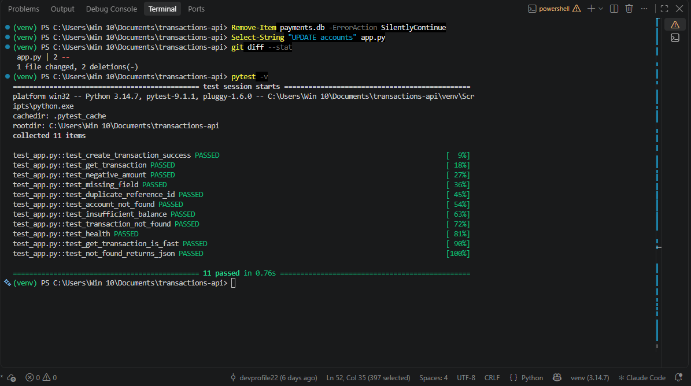
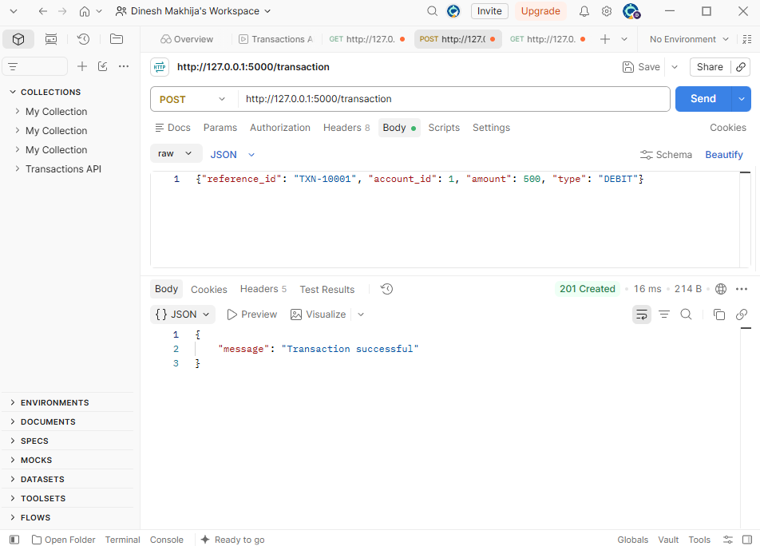
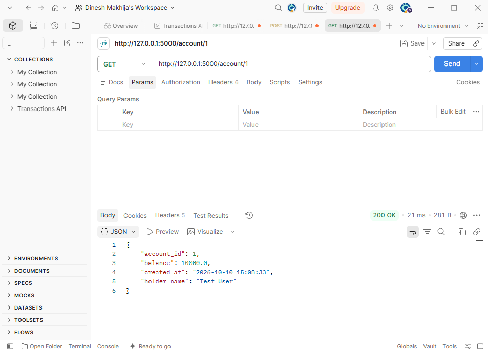
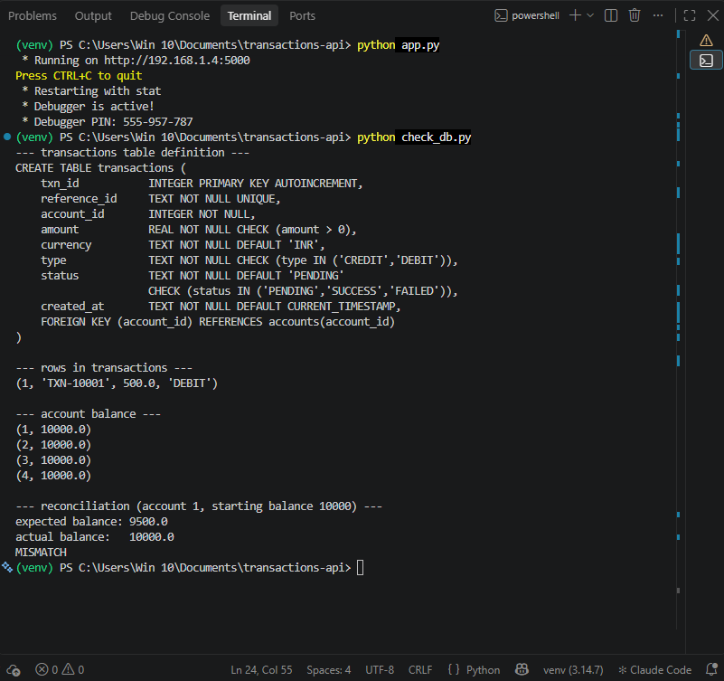
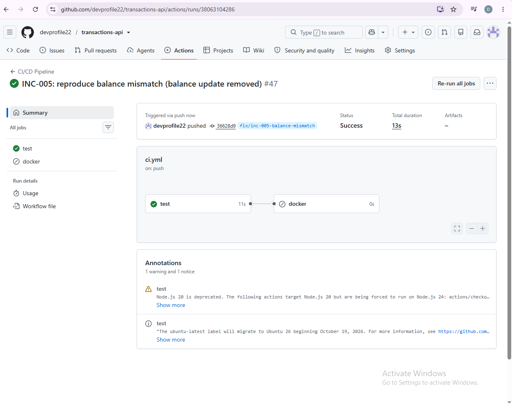
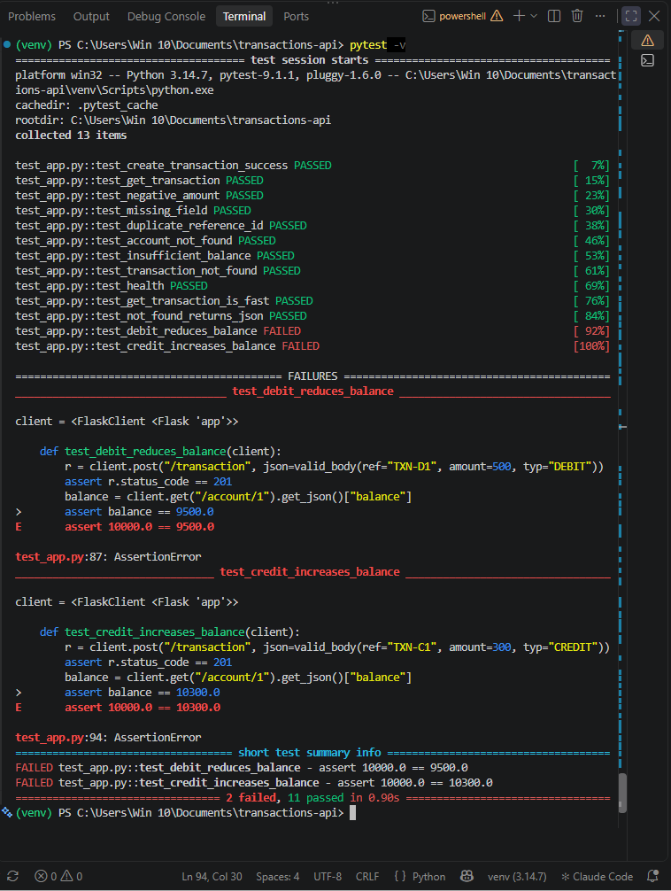
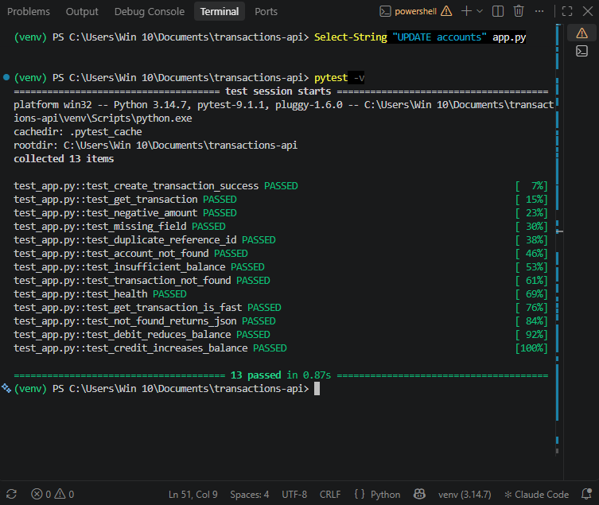
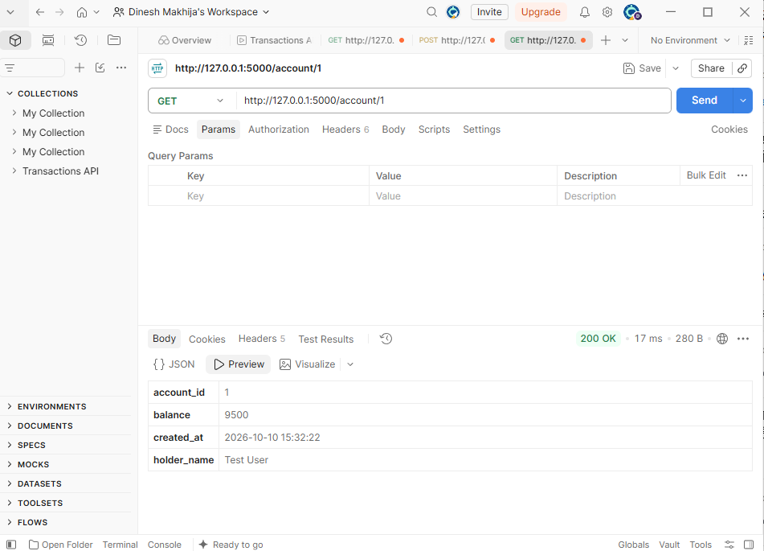
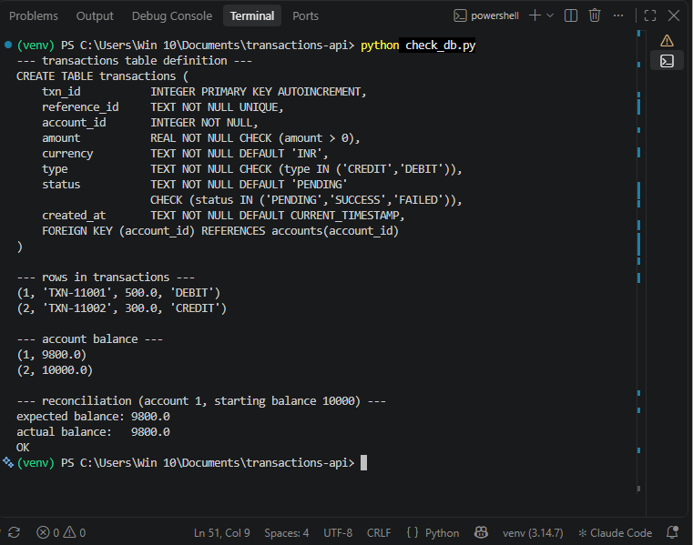

# INC-005: Account balance not updated after a successful transaction

| Field | Value |
|---|---|
| Ticket ID | INC-005 |
| Reported by | Reconciliation check (expected vs actual balance) |
| Date opened | 2026-10-10 20:45 |
| Category | Application / Data consistency |
| Severity | Sev 1 (Critical) |
| Priority | P1 |
| SLA | Respond in 15 min, resolve in 1 hr |
| Status | Closed |

## Issue
POST /transaction returns 201 "Transaction successful" and stores the transaction, but the account balance does not change. A DEBIT of 500 left the balance at 10000 instead of 9500.

## Impact
- Money records are wrong without any error: the API says success while balances are not updated.
- DEBITs are not deducted (the business loses money) and CREDITs are not added (customers lose money).
- Every transaction is affected, and the mismatch grows with each one.
- It is silent: no error, no failed test, and /health stays UP, so it can go unnoticed until someone reconciles.
- Fixing the code does not repair existing wrong balances, those need a separate correction.

## Severity and Priority reasoning
| Question | Answer |
|---|---|
| Impact | High: all transactions, direct financial effect |
| Urgency | High: every new transaction adds more wrong data |
| Priority (Impact x Urgency) | P1 |
| Severity | Sev 1: core money logic is broken, even though the service is up |
| Why higher than INC-001 and INC-002 | Those affected specific inputs, this one affects every request and nothing signals the failure |

## Steps Taken
1. Reproduced in Postman: POST DEBIT 500 returned 201, then GET /account/1 returned balance 10000.0 instead of 9500.0.
2. Ran pytest: 11 passed. No test checks the balance, so the bug was invisible to the tests.
3. Pushed the branch: CI (GitHub Actions) stayed green for the same reason.
4. Ran the reconciliation in check_db.py: expected 9500.0, actual 10000.0, MISMATCH.
5. Inspected create_transaction in app.py: the UPDATE accounts statement is missing, only the INSERT into transactions runs.

## Root Cause
The UPDATE accounts statement was removed from create_transaction, so the transaction row is inserted but the balance is never changed. The tests only check status codes, so nothing failed. The INSERT and the balance UPDATE share one commit, so they succeed or fail together; the drift happened only because the UPDATE was missing.

## Evidence (before fix)

**pytest: 11 passed, yet the bug is present:**

**Postman: POST returns 201:**

**Postman: balance still 10000.0:**

**Reconciliation: expected 9500, actual 10000, MISMATCH:**

**CI stayed green on GitHub Actions:**

## Resolution
Restored the UPDATE accounts statement in create_transaction so the balance changes together with the transaction row, and added two balance tests. Verified:
- pytest: 13 passed (the two new tests failed against the buggy code with 2 failed, 11 passed)
- Postman: DEBIT 500 gives balance 9500.0, then CREDIT 300 gives 9800.0
- Reconciliation in check_db.py: expected 9800.0, actual 9800.0, OK
- Existing wrong balances were not repaired by the code fix. In this test environment payments.db was deleted and recreated. In a real system a separate correction script would recompute balances from the transaction history.

## Preventive Action
- New tests test_debit_reduces_balance and test_credit_increases_balance assert the balance after each transaction. They run on every push via GitHub Actions, so removing the balance update again fails CI.
- Lesson: all earlier tests checked only status codes. For money logic, test the resulting data, not just the response.
- Keep the INSERT and the balance UPDATE under a single commit (as now), so a failure cannot leave them half-done.
- Follow-up: run the reconciliation query regularly (for example from a scheduled job) so a mismatch is detected within minutes, not by chance.
- Follow-up: add the balance check to monitor.py or a separate script and alert on MISMATCH.

## Evidence (after fix)

**New balance tests failed on the buggy code, proving they detect the problem:**

**pytest: 13 passed:**

**Postman: balance now 9500.0 after a DEBIT of 500:**

**Reconciliation: expected equals actual, OK:**

Date resolved: 2026-10-10 21:00
Date closed:   2026-10-10 21:10